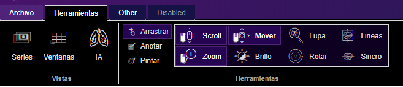

# React Ribbon Menu

Ribbon Menu component with React




### Installing

A step by step series of examples that tell you how to get a development env running

Say what the step will be

```
npm install --save react-ribbonmenu-js react react-dom
```

## Built With

* [React](https://es.reactjs.org/) - The web framework used

## Authors

* **Jesus Santiago Tovar** - *Initial work* - [jesusjames](https://github.com/jesusjames)

## License

This project is licensed under the ISC License - see the [LICENSE.md](LICENSE.md) file for details

## Acknowledgments

* Hat tip to anyone whose code was used
* Inspiration
* etc